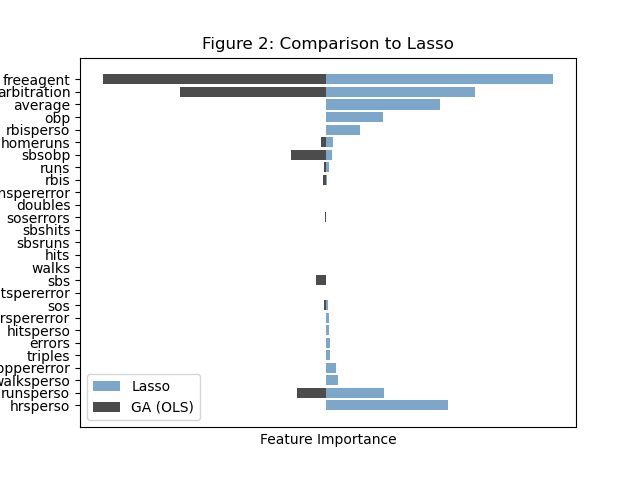
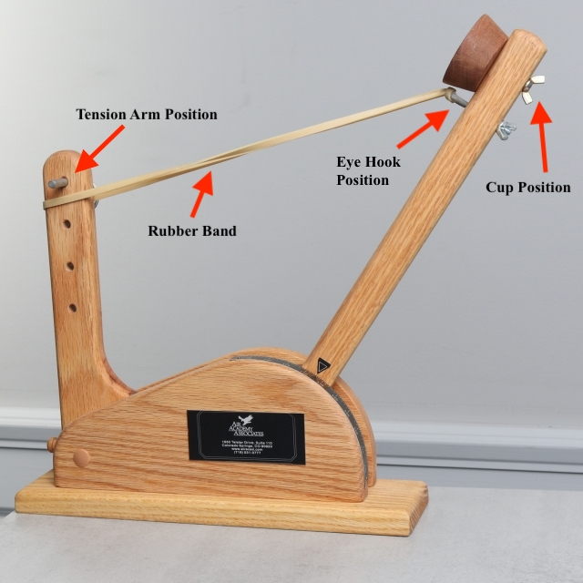
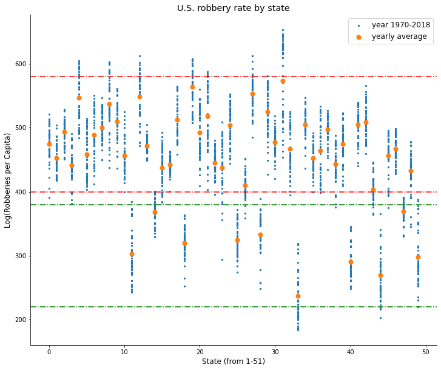

## Skills 
**Programming Languages**: Python (NumPy, SciPy, pandas, matplotlib, seaborn, PyMC3, TensorFlow, Dask), R (ggplot2, tidyverse, gee, lme4), Git/GitHub, Unix/Shell, C/C++, SQL, Stata, Matlab, Minitab

## Education
M.A., Statistics | University of California, Berkeley (*In Progress*)
B.S., Comp. Applied Math & Statistics | William & Mary (*December 2022*)

## Projects
### [Genetic Algorithm For Variable Selection](https://github.com/seanzhou1207/Genetic-Algorithm/blob/main/Report/final_report.pdf)
- Developed a Python package employing genetic algorithms for enhanced variable selection in regression and GLM models
- Integrated user-customizable parameters like genetic operators and mutation rates; achieved thorough performance testing against real and simulated datasets

### [Building a Statapult Firing Table Using Experimental Design](https://github.com/seanzhou1207/Statapult/tree/main)
- Explored the impact of four variables (pull back angle, release angle, eye hook position, and tension arm position) on statapult firing range using a $2_{IV}^{4-1}$ fractional factorial design
- Created a firing table by iteratively finding minimum variance factor combinations for each target range and achieved high model predictability ($R^2$ > 90%)

### [Unveiling the Effects of Right-to-Carry Laws Through Advanced Bayesian Analysis](https://github.com/seanzhou1207/Bayesian-Econometrics/blob/main/Shall_5.ipynb)
- Visualized crime data on 50 U.S. states from 1970 to 2018 to discover state heterogeneities in U.S. robbery rate
- Used a mixed, unpooled and a hierarchical model to estimate the effect of implementing the shall-issue law on robbery rate
- All three models show that the passing of the law reduces robbery rates in the long run

